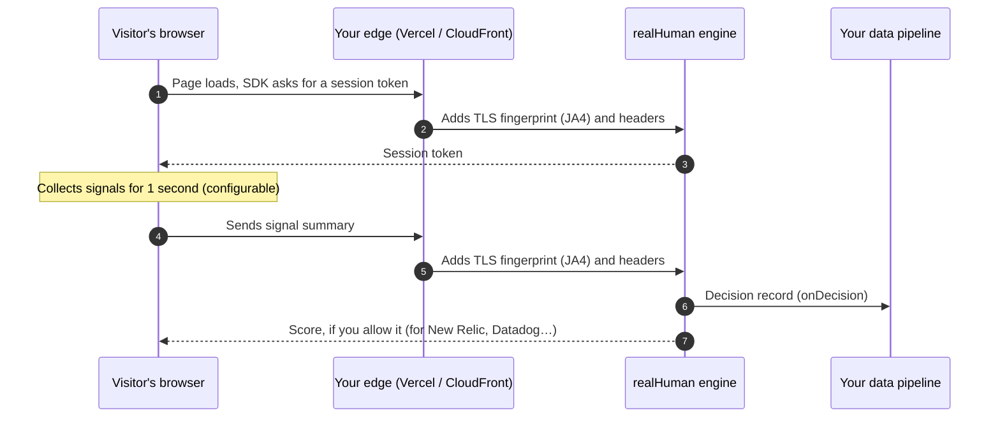

<div align="center">

# realHuman

**Know which visits came from real people, without blocking anyone.**

realHuman labels every page load as `human`, `bot` or somewhere in between, with the evidence behind it,
so you can filter bots out of your analytics, dashboards and reports.

[](https://github.com/your-org/realhuman/actions/workflows/ci.yml)
[](LICENSE)

[Quickstart](#quickstart) · [Documentation](docs/README.md) · [How it works](docs/getting-started/how-it-works.md) · [Privacy](docs/operations/privacy-and-compliance.md) · [Security](SECURITY.md)

</div>

---

> [!IMPORTANT]
> **Project status: pre-1.0.** Every package is implemented and tested. In the latest local
> [bot lab](tools/bot-lab) run, 50 of 55 automated sessions were labelled `bot`, including every commodity and
> stealth technique. The other 5, a purpose-built bot with human-like movement and hidden headless traits, were
> labelled `suspicious`; none passed as human. The false-positive rate on real people **has not been measured
> yet**; follow [Proving it works](docs/guides/evaluation.md) with the hostable [Vercel demo](apps/vercel-demo) to
> measure it. The packages are not yet published to npm. See the [roadmap](docs/roadmap.md).

## What is realHuman?

Bots make up a large share of web traffic. Most of them never announce themselves, so they end up in your
page views, conversion rates and A/B test results.

realHuman adds a small script to your site. The script quietly gathers **non-identifying** signals, such
as how the mouse moves, how typing is paced and whether the browser is being remote-controlled. Your server
combines those signals with what it can see of the network connection and gives every visit a **label**,
with the evidence behind it:

```json
{ "label": "human", "botEvidence": "none", "humanEvidence": "strong", "primaryReason": "pointer_natural" }
```

The five labels are `human`, `unverified` (no evidence either way, typically a quick visit), `suspicious`, `bot`
and `verified_agent`. You then use the label to **filter your data**, for example `WHERE label <> 'bot'`. See
[Understanding results](docs/guides/understanding-results.md). realHuman never blocks, challenges or slows down a visitor,
and a visitor never sees anything different.

### What realHuman is *not*

| realHuman is not… | Why it matters |
|---|---|
| **A firewall or CAPTCHA** | It never blocks or challenges anyone. Scores are for your data only. If you need blocking, use a WAF alongside it. |
| **A tracking or fingerprinting tool** | It stores nothing on the device and creates no identifier that follows a person between visits. See [Privacy](docs/operations/privacy-and-compliance.md). |
| **A hosted service** | It runs inside your own infrastructure (Vercel, AWS CloudFront or Node.js). Your data stays with you. |

## How it works in 30 seconds



1. **Collect.** The browser SDK watches for signals from the moment the page loads.
2. **Send.** After `flushAfterMs` (default 1000 ms) it sends a summary to *your* server, and sends one final update as the page closes.
3. **Label.** Your server adds network evidence (the [JA4](docs/glossary.md#ja4) TLS fingerprint, user agent and headers) and labels the visit with explainable rules: a few conclusive checks first, then weighted evidence for and against. Every label comes with the reasons behind it.
4. **Deliver.** Your backend receives every decision. You can also choose to send the label and score back to the page for tools like New Relic.

Read the full version: [How it works](docs/getting-started/how-it-works.md).

## Choose your setup

You make two choices.

| Choice | Options | Default | Guide |
|---|---|---|---|
| **Where does it run?** | Vercel · AWS CloudFront · Node.js | – | [Vercel](docs/getting-started/quickstart-vercel.md) · [CloudFront](docs/getting-started/quickstart-cloudfront.md) · [Node.js](docs/getting-started/quickstart-node.md) |
| **Who gets the result?** | `server` · `client` · `both` | `server` | [Delivery modes](docs/guides/delivery-modes.md) |

## Try it locally in two minutes

You need Node.js 22+ and pnpm (`corepack enable`).

```bash
git clone https://github.com/your-org/realhuman.git
cd realhuman
pnpm install
pnpm build
pnpm --filter @realhuman/demo start
```

Open <http://localhost:3000>, move the mouse, scroll and type. Your label appears at the top of the page, and
the server's decision records, reason codes included, appear in the table below. To see bots being caught, run
`pnpm --filter @realhuman/bot-lab lab` (it uses your installed Chrome).

## Quickstart

This example uses Next.js on Vercel. **Step 1: install the packages.**

```bash
npm install @realhuman/client @realhuman/vercel
```

**Step 2: add a secret.** Generate a random secret and save it as the environment variable `REALHUMAN_SECRET`
in your Vercel project (*Settings → Environment Variables*):

```bash
node -e "console.log(require('node:crypto').randomBytes(32).toString('base64'))"
```

**Step 3: add the server route.** Create `app/api/realhuman/[action]/route.ts`:

```ts
import { createHandlers } from '@realhuman/vercel';

export const { GET, POST } = createHandlers({
  onDecision: async (record) => {
    // Send to your data pipeline. One record per update; the highest `seq` for a `sid` is the latest.
    console.log(JSON.stringify(record));
  },
});
```

**Step 4: start the SDK in the browser.** Add this to a client component that loads on every page:

```ts
'use client';
import { init } from '@realhuman/client';

init(); // defaults: endpoint '/api/realhuman', first update after 1000 ms
```

**Step 5: deploy and check.** Open your site, wait a couple of seconds, then look at your function logs in
the Vercel dashboard. You should see a decision record with a `label`.

Full walkthroughs: [Vercel](docs/getting-started/quickstart-vercel.md) · [CloudFront](docs/getting-started/quickstart-cloudfront.md) · [Node.js](docs/getting-started/quickstart-node.md)

## Packages

| Package | What it does |
|---|---|
| [`@realhuman/schema`](packages/schema) | Data formats and TypeScript types shared by everything else |
| [`@realhuman/client`](packages/client) | Browser SDK: signal collection, honeypots, sending, integrations. No runtime dependencies, under 9 KB gzipped |
| [`@realhuman/engine`](packages/engine) | Scoring engine, session tokens, decision records, re-scoring CLI |
| [`@realhuman/vercel`](packages/vercel) | Vercel / Next.js adapter, including edge tagging |
| [`@realhuman/aws`](packages/aws) | AWS Lambda + CloudFront adapter and CDK construct |
| [`@realhuman/react`](packages/react) | React provider and hook |
| [`@realhuman/node`](packages/node) | Express, Connect, `node:http`, Hono, Bun and Deno adapter |

Also in the repo:

| Folder | What it is |
|---|---|
| [`apps/vercel-demo`](apps/vercel-demo) | A demo you can host on Vercel in ten minutes; also collects labelled test sessions |
| [`apps/demo`](apps/demo) | A zero-setup local demo |
| [`tools/bot-lab`](tools/bot-lab) | Runs 11 automation techniques against a demo |
| [`tools/eval`](tools/eval) | Turns labelled sessions into detection and false-positive rates with confidence intervals |

## Documentation

Everything is in [`docs/`](docs/README.md). Good places to start:

- **New to this?** [What is realHuman?](docs/getting-started/what-is-realhuman.md) → [How it works](docs/getting-started/how-it-works.md) → a quickstart
- **Building the integration?** [Configuration reference](docs/reference/configuration.md) · [Data formats](docs/reference/data-formats.md) · [Filtering your data](docs/guides/filtering-your-data.md)
- **Reviewing it for your organisation?** [Security](docs/operations/security.md) · [Privacy & compliance](docs/operations/privacy-and-compliance.md) · [Versioning & support](docs/operations/versioning-and-support.md)
- **Stuck?** [Troubleshooting](docs/operations/troubleshooting.md) · [Glossary](docs/glossary.md)

## Privacy at a glance

- **Never collected:** key values, form contents, mouse coordinates, IP addresses, canvas/audio/font fingerprints.
- **Never stored on the device:** no cookies, localStorage or other persistent identifier.
- **Only summaries leave the browser.** For example, "typing rhythm varied naturally", not the keys pressed.
- **Consent-ready:** start with `init({ consent: false })` and call `grantConsent()` when your consent tool allows it.
- **Your ids only if you add them:** records carry no identifier unless you attach one, such as a user id. See
  [Attaching a user id](docs/guides/filtering-your-data.md#attaching-a-user-id).

Details: [Privacy & compliance](docs/operations/privacy-and-compliance.md).

## Design principles

realHuman's checks follow the lessons of
[Browser Fingerprinting 2026: What Works, What Doesn't](https://webdecoy.com/blog/browser-fingerprinting-2026-what-still-works/)
(Chris Portscheller, WebDecoy, March 2026):

- **Consistency, not identity.** No single signal proves anything. realHuman asks whether a browser's claims
  agree with each other: the user agent, Client Hints, TLS fingerprint, graphics stack and a Web Worker should
  all describe the same browser. A bot can fake any one of them; keeping every layer consistent is much harder.
- **The network layer can't be faked from JavaScript.** The JA4 TLS fingerprint comes from the connection
  itself, which page scripts can't change. It shows whether a real browser or an HTTP library connected, without identifying
  anyone: everyone on the same browser build shares it.
- **Weak signals stay weak.** Screen size, window geometry and plugin lists are easy to fake and shared by
  millions of devices. On their own they can make a session `suspicious`, never `bot`. The user agent is used
  for consistency checks, and decides on its own only when it openly says it's a bot.
- **Behaviour alongside the environment.** Browsers driven by automation tools share real browsers'
  fingerprints, so mouse, typing, touch and scroll rhythms add evidence the environment checks can't.
- **Privacy settings aren't bot evidence.** Brave, Tor, Firefox's fingerprinting protection, extensions and
  company proxies change what a browser reports. realHuman recognises privacy browsers and switches off the
  checks they trip, and a check that can't run counts as no evidence, never as bot evidence.
- **No canvas, audio or font fingerprinting.** Those techniques identify devices, which realHuman is designed
  not to do, and browsers increasingly randomise them anyway.
- **Measure false positives before trusting it.** That's why realHuman labels data instead of blocking, and why
  it ships with [evaluation tooling](docs/guides/evaluation.md) that breaks results down by browser.

## For enterprise teams

| Topic | Where |
|---|---|
| Threat model, trusted headers, secret rotation | [Security](docs/operations/security.md) |
| Reporting a vulnerability | [SECURITY.md](SECURITY.md) |
| Data collected, consent, DPIA checklist, subprocessors | [Privacy & compliance](docs/operations/privacy-and-compliance.md) |
| Bundle size and latency budgets | [Performance](docs/operations/performance.md) |
| Semantic versioning, support windows, deprecation policy | [Versioning & support](docs/operations/versioning-and-support.md) |
| Supply chain: npm provenance, minimal dependencies | [Versioning & support](docs/operations/versioning-and-support.md#supply-chain) |
| Getting help | [SUPPORT.md](SUPPORT.md) |

## Contributing

Contributions are welcome. Read [CONTRIBUTING.md](CONTRIBUTING.md) for how to set up the repo, run the
tests and propose changes. Everyone taking part must follow the [Code of Conduct](CODE_OF_CONDUCT.md).

## License

[MIT](LICENSE)
