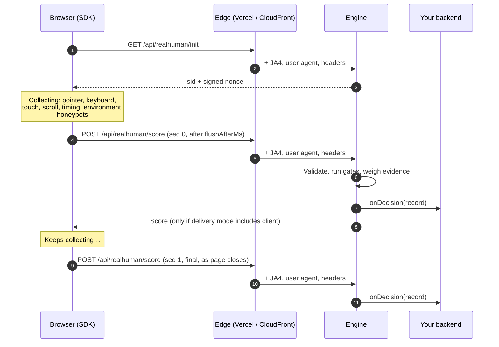

# How it works

This page follows one page load from start to finish. You don't need to understand it all to use
realHuman, but it helps when deciding how to configure it.

## The full journey

## Step 1: The page loads and the SDK starts

As soon as `init()` runs, the SDK:

1. Creates no cookies and writes nothing to storage.
2. Asks your server for a **session token** (`GET /api/realhuman/init`). The server replies with a random
   **sid** and a signed **nonce**. The nonce is tied to the visitor's TLS fingerprint and browser, so it
   can't be copied to another client and reused.
3. Starts listening for signals. Every listener is *passive*, so it never slows scrolling or typing.
4. If honeypots are on, adds invisible trap fields to your forms.

## Step 2: Signals are collected

The SDK collects summaries, not raw data. For example:

| It records… | It never records… |
|---|---|
| "84 pointer moves, curvy, speed varied a lot" | Where the pointer was on the screen |
| "12 key presses, uneven rhythm, 0 pastes" | Which keys were pressed |
| "the browser reports it is being automated" | Anything identifying the device |

The full list is in [Signals](../reference/signals.md).

## Step 3: The first update is sent

After **`flushAfterMs`** (default `1000` ms) the SDK sends its first update (`seq: 0`). It keeps
collecting afterwards, and sends:

- **an update whenever you call `score()`**, for example just before an important form is submitted, and
- **a final update when the page is closed or hidden** (`final: true`). This has the most evidence, but the browser doesn't always manage to send it.

> [!TIP]
> One second is often not enough time for a person to interact. That's fine: realHuman doesn't treat "no
> interaction yet" as bot evidence. It just reports lower **confidence**. Later updates fill in the picture.

## Step 4: The edge adds network evidence

Your CDN or hosting platform terminates the secure (TLS) connection, so it can see things the browser
can't fake from JavaScript:

- the **JA4 fingerprint** of the TLS connection,
- the **user agent** and **Client Hints** headers,
- **Fetch metadata** headers (`Sec-Fetch-*`) that real browsers always send,
- the **time zone of the IP address**,
- any **Web Bot Auth** signature from an AI agent that identifies itself.

The adapter for your platform reads these from headers the platform sets itself, which visitors can't
forge. This only holds if your server can't be reached except through the CDN; see
[Security](../operations/security.md#trusted-headers).

## Step 5: The engine decides

The engine works in four stages:

1. **Validate.** Is the payload well-formed? Is the nonce genuine, unexpired and presented by the same client it was issued to?
2. **Gates.** Some evidence is conclusive on its own: a filled honeypot, a followed trap link, automation framework globals, or a user agent that openly says it's a bot. Any of these ends the analysis: the label is `bot`, with conclusive bot evidence.
3. **Verified agents.** An AI agent with a valid Web Bot Auth signature, from an agent you have chosen to trust (`webBotAuth.agents`), gets the verdict `verified_agent`, so you can decide separately whether to count it.
4. **Evidence levels and label.** Every other piece of evidence has a weight. Bot-leaning weights add up to a
   **bot evidence** level (none, weak, moderate, strong) and human-leaning weights to a **human evidence** level
   (none, some, strong). Strong bot evidence makes the label `bot` and moderate makes it `suspicious`; otherwise
   human evidence makes it `human`, and no evidence leaves it `unverified`. The same weights also produce a
   score for ranking. See [Understanding results](../guides/understanding-results.md).

Most of the strongest evidence is about **consistency** rather than identity: do the user agent, Client Hints,
TLS fingerprint, graphics stack and a Web Worker all describe the same browser? A bot can fake any one of these,
but keeping them all in agreement is much harder. A TLS connection that no browser would make is weighted
evidence rather than a gate (on its own it makes a session `suspicious`), because some company proxies and
security tools re-make connections that way.

Privacy-hardened browsers (Brave, Tor, Firefox with fingerprinting resistance) deliberately report
inconsistent details. realHuman recognises them and switches off the penalties that would otherwise
mark their users as bots.

## Step 6: The result is delivered

| Delivery mode | Your backend gets | The browser gets |
|---|---|---|
| `server` (default) | Every decision record via `onDecision` | Nothing (HTTP 204) |
| `client` | Nothing | `{ sid, seq, realHuman, label, verdict, confidence }` |
| `both` | Every decision record | `{ sid, seq, realHuman, label, verdict, confidence }` |

Each update for the same `sid` replaces the previous one, and **the highest `seq` is the final answer**.
See [Delivery modes](../guides/delivery-modes.md) and [Ingesting decisions](../guides/ingesting-decisions.md).

Records can also carry your own ids, such as an analytics client id or a signed-in user's id. See
[Attaching a user id](../guides/filtering-your-data.md#attaching-a-user-id).

## Visitors without JavaScript

Many bots never run JavaScript, so they never send signals. They usually don't show up in JavaScript-based
analytics either, which makes them less of a problem there. For server logs, the adapters can label every
request using network evidence alone (`kind: "no_js"`). See the quickstart for your platform.

## Next

Pick a quickstart: [Vercel](quickstart-vercel.md) · [AWS CloudFront](quickstart-cloudfront.md) · [Node.js](quickstart-node.md).
