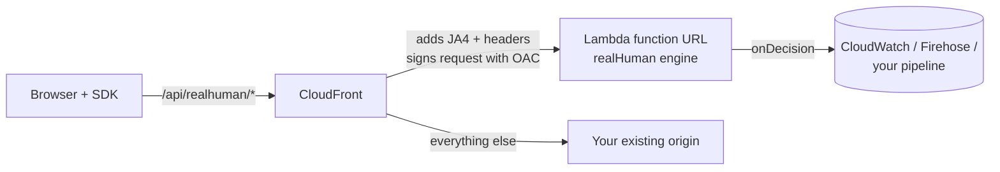

# Quickstart: AWS CloudFront

**Time needed:** about 20 minutes with CDK, or 40 minutes by hand.
**You'll end up with:** CloudFront sending `/api/realhuman/*` to a Lambda function that scores each page
load, with results in CloudWatch Logs.

## How the pieces fit



CloudFront works out the visitor's **JA4 TLS fingerprint** and passes it to the Lambda function in the
`CloudFront-Viewer-JA4-Fingerprint` header. The Lambda function only accepts requests that come through your
distribution, enforced by Origin Access Control (OAC), so nobody can call it directly with a forged
fingerprint.

## Before you start

You need:

- [ ] An existing CloudFront distribution in front of your site
- [ ] Node.js 22 or newer on your computer
- [ ] For option A: an AWS CDK v2 app that defines (or can define) that distribution
- [ ] Permission to create Lambda functions, Secrets Manager secrets and CloudFront policies

## Step 1: Create a secret

realHuman signs its session tokens with a secret. Store one in AWS Secrets Manager:

```bash
aws secretsmanager create-secret \
  --name realhuman/secret \
  --secret-string "$(node -e "console.log(require('node:crypto').randomBytes(32).toString('base64'))")"
```

The Lambda function loads it on its first request and caches it, so the secret never appears in your code or
environment variables. To rotate without downtime, store JSON instead: `{"current": "<new>", "previous": "<old>"}`
(see [Security](../operations/security.md#rotating-the-secret)).

## Step 2: Write the Lambda handler

Install the package in your CDK app:

```bash
npm install @realhuman/aws
```

Create **`lambda/realhuman.ts`**:

```ts
import { createLambdaHandler } from '@realhuman/aws';

export const handler = createLambdaHandler({
  // Every decision. Logging to CloudWatch is the simplest start;
  // a CloudWatch subscription or Firehose can carry it to your warehouse.
  onDecision: async (record) => {
    console.log(JSON.stringify({ type: 'realhuman', ...record }));
  },
});
```

## Step 3, option A (recommended): Deploy with the CDK construct

In your stack, next to your distribution:

```ts
import { RealHumanEndpoint } from '@realhuman/aws/cdk';
import * as secretsmanager from 'aws-cdk-lib/aws-secretsmanager';

new RealHumanEndpoint(this, 'RealHuman', {
  distribution, // your existing cloudfront.Distribution
  entry: 'lambda/realhuman.ts',
  secret: secretsmanager.Secret.fromSecretNameV2(this, 'RealHumanSecret', 'realhuman/secret'),
});
```

Then deploy:

```bash
npx cdk deploy
```

The construct creates and wires up:

| Resource | Purpose |
|---|---|
| Lambda function + function URL | Runs the engine |
| Origin Access Control | Only your distribution can call the function |
| Cache behaviour `/api/realhuman/*` | Routes SDK traffic to the function, with caching disabled |
| Origin request policy | Forwards the headers the engine needs (list below) |
| IAM permission | Lets the function read the secret |

Skip to [Step 4](#step-4-start-the-sdk-in-the-browser).

## Step 3, option B: Set it up by hand

Use this if your distribution isn't managed by CDK.

1. **Create the Lambda function.** Bundle `lambda/realhuman.ts`:
   ```bash
   npx esbuild lambda/realhuman.ts --bundle --platform=node --target=node22 --external:@aws-sdk/* --supported:dynamic-import=false --outfile=dist/index.js
   ```
   Then create a Node.js 22 or 24 function from it with 256 MB of memory and a 5-second timeout (keep the timeout above
   `onDecisionTimeoutMs`, since on Lambda `onDecision` finishes before the response is returned).
2. **Give it the secret.** Set the environment variable `REALHUMAN_SECRET_ARN` to the ARN of `realhuman/secret`, and give the function's role `secretsmanager:GetSecretValue` on that secret.
3. **Add a function URL** with auth type **AWS_IAM**.
4. **Add the function URL as an origin** of your distribution, with a new **Origin Access Control** of type *Lambda*. Add the resource policy the console offers so CloudFront can invoke the URL. CloudFront needs both `lambda:InvokeFunctionUrl` and `lambda:InvokeFunction` (the latter with the condition `lambda:InvokedViaFunctionUrl = true`), each scoped to your distribution's ARN.
5. **Create an origin request policy** that forwards these headers:

   | Header | Why |
   |---|---|
   | `CloudFront-Viewer-JA4-Fingerprint` | TLS fingerprint |
   | `CloudFront-Viewer-Time-Zone` | IP time zone |
   | `User-Agent` | Claimed browser |
   | `Sec-CH-UA`, `Sec-CH-UA-Platform` | Client Hints |
   | `Sec-Fetch-Site`, `Sec-Fetch-Mode` | Fetch metadata |
   | `x-amz-content-sha256` | Required by OAC for POST bodies |
   | `Origin` | Only needed if you use `allowedOrigins` (CORS) |

   That's 9 headers; CloudFront's default quota is 10 per origin request policy. To verify self-identifying AI
   agents, also forward `Signature`, `Signature-Input` and `Signature-Agent` (12 in total, which needs a quota
   increase) and set `webBotAuth.authority` to your site's host name.

   Forward all query strings and no cookies. Do **not** forward the `Host` header to a Lambda function URL, or
   requests will fail with 403.
6. **Add a cache behaviour** for the path pattern `/api/realhuman/*`: allowed methods *GET, HEAD, OPTIONS, PUT, POST, PATCH, DELETE*, cache policy **CachingDisabled**, and the origin request policy from step 5.

## Step 4: Start the SDK in the browser

Install the SDK in your website project:

```bash
npm install @realhuman/client
```

and start it on every page:

```ts
import { init } from '@realhuman/client';

init({
  awsContentHash: true, // required with OAC: lets CloudFront sign POST requests to Lambda
});
```

> [!IMPORTANT]
> `awsContentHash: true` is required for CloudFront + Lambda function URLs with OAC. Without it, every
> score request fails with **403**. It adds a SHA-256 hash of the request body in a header, which AWS needs
> to sign the request.

No build step? Use the script tag instead:

```html
<script src="/realhuman.js" data-aws-content-hash="true" defer></script>
```

(Copy `node_modules/@realhuman/client/dist/realhuman.iife.js` to your site as `/realhuman.js`. Hosting
it on your own domain avoids ad blockers.)

## Step 5: Check it works

1. Open your site in a normal browser, move the mouse and scroll for a few seconds.
2. In the AWS console, open **CloudWatch → Log groups** and find the function's log group.
3. Search for `realhuman`.

✅ **It worked if** you see decision records with a `realHuman` score and a non-null `server.ja4`.

`server.ja4` is `null`? The origin request policy isn't forwarding `CloudFront-Viewer-JA4-Fingerprint`;
recheck step 3. Other problems: [Troubleshooting](../operations/troubleshooting.md).

## Optional next steps

| Want to… | Do this |
|---|---|
| Send results to S3, Redshift, Snowflake or BigQuery | Use Kinesis Data Firehose in `onDecision`. See [Ingesting decisions](../guides/ingesting-decisions.md) |
| Show the score to New Relic, Datadog or GA4 | Set `deliver: 'both'`. See [Frontend integrations](../guides/frontend-integrations.md) |
| Add honeypots to your forms | [Honeypots](../guides/honeypots.md) |
| Attach a user id to each record | [Attaching a user id](../guides/filtering-your-data.md#attaching-a-user-id) |

> [!NOTE]
> **Why not Lambda@Edge?** It can't use environment variables, must be deployed in `us-east-1`, and takes longer
> to roll out changes. A regional Lambda function behind CloudFront is simpler to run and fast enough for this
> job. The adapter handles Lambda function URL events only; Lambda@Edge isn't supported.
